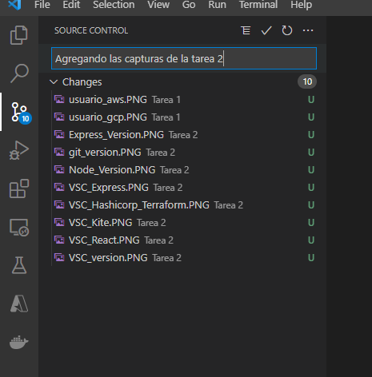

# Tarea 2

- [x]  Todos los miembros tengan Git en su ultima versión.

- [x]  Creación de un directorio sincronizado con el repositorio.

- [x]  Sincronizar Visual Studio Code con el repositorio.

- [x]  Todos los miembros tengan Visual Studio en su ultima versión. Con los _plugins Terraform, HTML Marks, Autocompletado, Javascript, Node y React.

- [x]  Todos los miembros tengan NodeJS en su ultima versión, sincronizado con Visual Studio.

- [x]  Todos los miembros tengan el modulo ReactJS y Express.

- [x]  Tener actualizado Trello y Github de manera proactiva.
